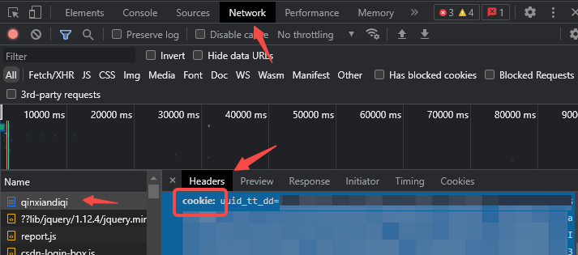

# 博客搬家打包工具
blog_packaging_tools是一个博客搬家打包备份工具，目前已支持的博客类型有CSDN，支持导出的格式有hugo风格的markdown文件（文章中的图片会同步下载）。  
blog_packaging_tools本身预留了扩展，后续有需求可自由扩展其他类型的博客和导出格式。

## 使用方法

1. clone项目到本地：  
    ```
    git clone https://github.com/qinxiandiqi/blog_packaging_tools.git
    ```
2. 确认本地已经安装python3环境，进入clone下来的blog_packaging_tools项目目录，使用pip/pip3安装项目以来python模块：
    ```
    pip install -r requirements.txt 
    ```
3. 复制项目根目录下`config.ini.sample`文件到根目录下，重命名为`config.ini`文件。
4. 填写`config.ini`配置文件下csdn相关参数。
    - blog_id: csdn博客的id
    - author：csdn博客作者名
    - cookie：csdn博客的cookie。cookie的获取方式：  
        使用chrome相关浏览器登录csdn后，按F12打开开发者工具。刷新自己的csdn博客主页，在开发者工具中找到自己博客主页的网络请求，在header头参数中找到cookie字段，右键菜单选择复制值，复制到`config.ini`配置文件的cookie字段（注意保留配置文件中的单引号）
        
    - start_page: 扫描csdn文章开始分页页码，默认1，从第1页开始扫描
    - end_page: 扫描csdn文章结束分页页码，默认100。当没有下一页或到达指定结束分页时停止扫描。
5. `blogs/packer/hugo/template.md`文件为导出hugo markdown文章模板，需要修改导出文章模板的话可以修改这个文件，具体支持的参数可查看默认模板文件中的参数。
6. 执行打包：
    ```
    python3 main.py
    ```
7. 结果输出到根目录下的output目录

